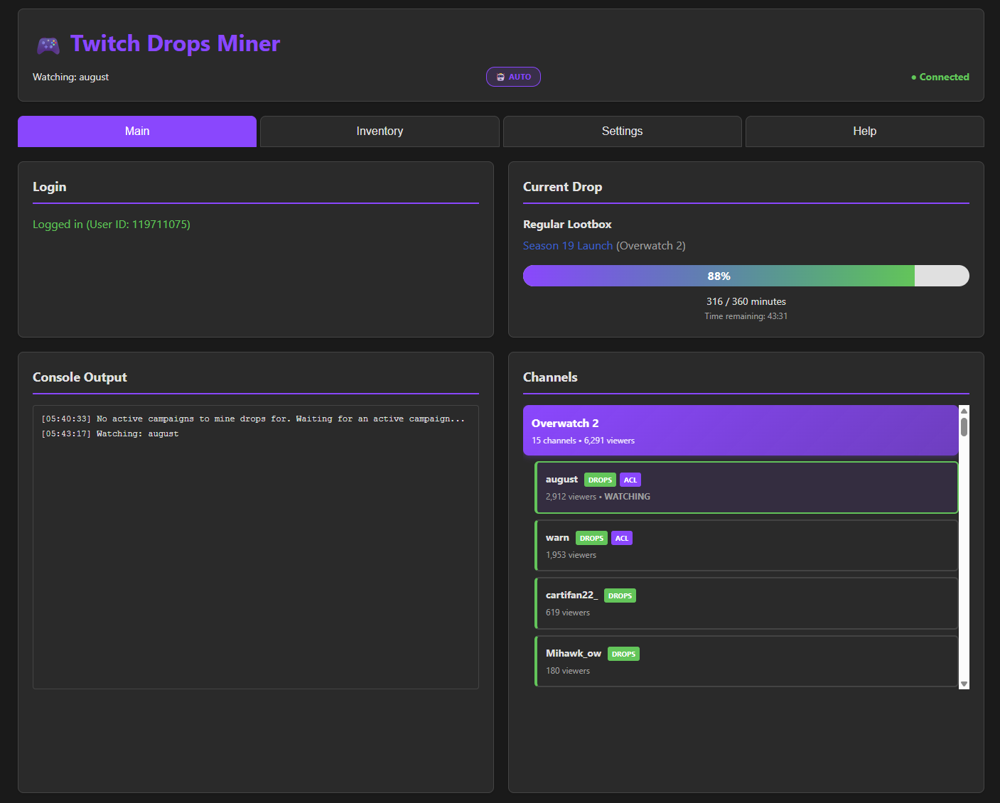

# 🌟 Twitch Drops Miner (TDM)

> 🎮 **Automate Twitch Drop Farming — Effortlessly, Headlessly, and Bandwidth-Free**

<p align="center">
  <a href="https://github.com/SimpliAj/twitchdropsminer/stargazers"></a>
  <a href="https://github.com/SimpliAj/twitchdropsminer/releases"></a>
  <a href="https://github.com/SimpliAj/twitchdropsminer/blob/main/LICENSE"></a>
  <a href="https://www.python.org/downloads/"></a>
</p>

A fork of [rangermix/TwitchDropsMiner](https://github.com/rangermix/TwitchDropsMiner) with multi-account support and an improved web UI.  
**Twitch Drops Miner** lets you automatically farm Twitch drops without ever opening a stream.  
No more tab juggling, channel switching, or missing rewards — just set it, forget it, and collect.

---

## 🔀 What's Different in This Fork

This fork extends [rangermix/TwitchDropsMiner](https://github.com/rangermix/TwitchDropsMiner) with:

- 👥 **Multi-Account Support** — Run multiple Twitch accounts from a single instance; each account gets its own isolated `data/accounts/<name>/` directory for cookies and settings
- ⚙️ **System Tab in Web UI** — Add, switch, and remove accounts directly from the browser without touching config files
- 🔌 **REST API for Account Management** — Full CRUD via `/api/accounts` endpoints (list, add, switch, remove)
- 🔒 **Dashboard Password Protection** — Set `WEB_PASSWORD` env var to lock the web UI behind a password (safe to expose publicly)
- 💰 **Channel Points Auto-Claimer** — Automatically claims bonus channel point chests every 60 seconds via GQL polling. Toggle in Settings.
- 💤 **Idle Watch** — When no drop campaigns are active, watches configured favorite channels to earn channel points. Supports multiple channels with priority ordering and automatic switching.
- 📊 **Channel Points Tracker** — Real-time balance display in the web UI with per-channel history, auto-refresh every 5 minutes, and persistent storage across restarts (`data/channel_points.json`).
- 🔔 **Discord Webhook Notifications** — Get notified in Discord when a drop is claimed or a channel points bonus chest is collected. Configure two separate webhooks in the Settings tab.
- 📱 **Mobile-Responsive UI** — Dashboard works on phone browsers with proper `@media` breakpoints (768px and 480px)
- 🔄 **`update.sh` Script** — One-command update that preserves your `data/accounts/` directory and all customizations

---

## ✨ Features

- 🚀 **Streamless Mining** — Earn drops without streaming video by sending Twitch watch events
- 🔍 **Automatic Campaign Discovery** — Detects new drop events automatically
- ⚙️ **Auto Channel Switching** — Always mines the best available stream
- 💾 **Persistent Login** — OAuth login saved via cookies
- 🕹️ **Simple Web UI** — Manage everything from your browser
- 🛡️ **Safe Frontend Rendering** — Dynamic UI content is rendered with DOM APIs to avoid HTML injection
- 🧩 **Docker-Ready** — One command to deploy anywhere
- 💰 **Channel Points Auto-Claimer** — Bonus chests claimed within 60s automatically
- 💤 **Idle Watch** — Earns channel points on favorite channels when no drops are active
- 📊 **Channel Points Tracker** — Live balance display with persistent history

---

## 🧰 Quick Start (Docker Recommended)

### 🐳 Using Pre-Built Image (Docker run)

```bash
docker pull rangermix/twitch-drops-miner:latest
docker run -d -p 8080:8080 -v $(pwd)/data:/app/data rangermix/twitch-drops-miner:latest
```

### 📦 Using Docker Compose

```yaml
services:
  twitch-drops-miner:
    image: rangermix/twitch-drops-miner:latest
    ports:
      - "8080:8080"
    volumes:
      - ./data:/app/data
      # optional, use if you want to persist logs
      - ./logs:/app/logs
    environment:
      # Set timezone (optional, defaults to UTC)
      - TZ=Australia/Sydney
    restart: unless-stopped
```

### 🧑‍💻 From Source (for Developers)

```bash
uv sync
uv run main.py
```

Visit 👉 **<http://localhost:8080>**

---

## 🌈 Using the Web App

1. Open `http://localhost:8080`
2. Login with your Twitch account (OAuth device flow)
3. The miner auto-fetches available campaigns
4. Go to **Settings → Games to Watch** and select games:
   - **Select Linked** — auto-selects games where your account is linked
   - **Add Game** — add any custom game by name
   - **Drag to reorder** — top = highest priority
   - **Select All / Deselect All** for quick changes
5. Click **Reload** to apply changes
6. TDM starts mining drops automatically 🎉

**Channel Points (Settings tab):**
- Enable **Auto-claim bonus channel points** to claim chests automatically
- Add channels to **Idle Watch** to earn points when no drops are active
- Balance is shown in the **Main tab** and updates every 5 minutes

📝 **Tip:**  
Make sure your Twitch account is linked to your game accounts →  
👉 [https://www.twitch.tv/drops/campaigns](https://www.twitch.tv/drops/campaigns)

---

## 🔒 Dashboard Password (Remote Access)

To protect the web UI when exposing it publicly (e.g. running on a VPS), set the `WEB_PASSWORD` environment variable:

```bash
# From source
WEB_PASSWORD=yourpassword uv run main.py
```

```yaml
# Docker Compose
environment:
  - WEB_PASSWORD=yourpassword
```

The dashboard will show a password prompt on first visit. Auth is stored as a 30-day session cookie. Change or remove the password from the **Settings** tab in the web UI at any time.

> **No `WEB_PASSWORD` set?** The dashboard is open to anyone who can reach the port — fine for localhost, not for public servers.

---

## ⚠️ Notes & Warnings

> ⚠️ **Avoid Watching on the Same Account**  
> Watching Twitch manually while the miner runs can cause progress desync.  
> Use a different account if you want to watch live streams while mining.

> 💡 **Requirements**  
> Python 3.12+  
> Docker optional but recommended  
> Persistent data stored in `/data`

---

## 🖼️ Screenshot


> A clean, modern web UI lets you control everything from your browser.

---

## 💬 Contributing

⭐ **Star this repo** if it's useful!  
💬 [Open an issue](../../issues) or [submit a PR](../../pulls) for bugs and improvements.

---

## 🎯 Project Goals

| Goal | Description |
|------|--------------|
| 🎯 **Focus** | Twitch Drops automation |
| 🧩 **Ease of Use** | Simple web UI |
| 🛡️ **Reliability** | Designed for continuous operation |
| ⚙️ **Efficiency** | Minimal API calls, Twitch-friendly |
| 🐳 **Deployment** | Docker-first, headless operation |

---

## 🙏 Acknowledgments

This project is a fork of the brilliant [TwitchDropsMiner](https://github.com/DevilXD/TwitchDropsMiner) by [@DevilXD](https://github.com/DevilXD).  
Huge thanks to DevilXD and all contributors who built the foundation.

For detailed translation and contribution credits, see [Acknowledgments](#original-project-credits) below.

---

## 🧾 Disclaimer

> ⚙️ This fork is heavily maintained and developed using AI-assisted coding (Claude Code).  
> While stable, the codebase reflects “vibe coding” patterns — always review changes before deployment.  
> Use responsibly.

---

## 🧑‍💻 Original Project Credits

<!---
Note: The translations credits are sorted alphabetically, based on their English language name.
When adding a new entry, please ensure to insert it in the correct place in the second section.
Non-translations related credits should be added to the first section instead.

Note: When adding a new credits line below, please add two trailing spaces at the end
of the previous line, if they aren't already there. Doing so ensures proper markdown
rendering on Github. In short: Each credits line should end with two trailing spaces,
placed past the period character at the end.

• Last line can have the two trailing spaces omitted.
• Please ensure your editor won't trim the trailing spaces upon saving the file.
• Please ensure to leave a single empty new line at the end of the file.
-->

@guihkx - For the CI script, CI maintenance, and everything related to Linux builds.  
@kWAYTV - For the implementation of the dark mode theme.  

@Bamboozul - For the entirety of the Arabic (العربية) translation.  
@Suz1e - For the entirety of the Chinese (简体中文) translation and revisions.  
@wwj010 - For the Chinese (简体中文) translation corrections and revisions.  
@zhangminghao1989 - For the Chinese (简体中文) translation corrections and revisions.  
@Ricky103403 - For the entirety of the Traditional Chinese (繁體中文) translation.  
@LusTerCsI - For the Traditional Chinese (繁體中文) translation corrections and revisions.  
@nwvh - For the entirety of the Czech (Čeština) translation.  
@Kjerne - For the entirety of the Danish (Dansk) translation.  
@roobini-gamer - For the entirety of the French (Français) translation.  
@Calvineries - For the French (Français) translation revisions.  
@ThisIsCyreX - For the entirety of the German (Deutsch) translation.  
@Eriza-Z - For the entirety of the Indonesian translation.  
@casungo - For the entirety of the Italian (Italiano) translation.  
@ShimadaNanaki - For the entirety of the Japanese (日本語) translation.  
@Patriot99 - For the Polish (Polski) translation and revisions (co-authored with @DevilXD).  
@zarigata - For the entirety of the Portuguese (Português) translation.  
@Sergo1217 - For the entirety of the Russian (Русский) translation.  
@kilroy98 - For the Russian (Русский) translation corrections and revisions.  
@Shofuu - For the entirety of the Spanish (Español) translation and revisions.  
@alikdb - For the entirety of the Turkish (Türkçe) translation.  
@Nollasko - For the entirety of the Ukrainian (Українська) translation and revisions.  
@kilroy98 - For the Ukrainian (Українська) translation corrections and revisions.  
