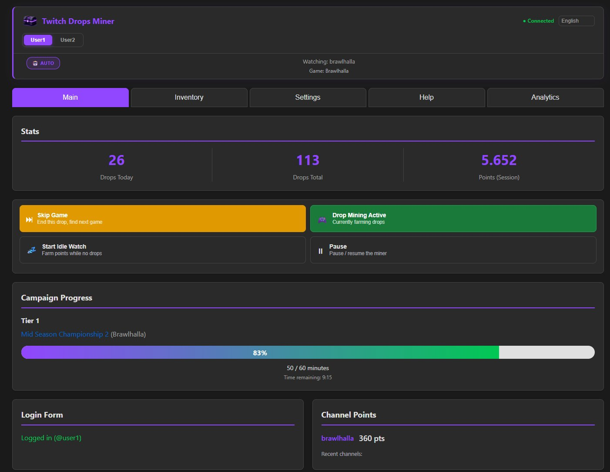
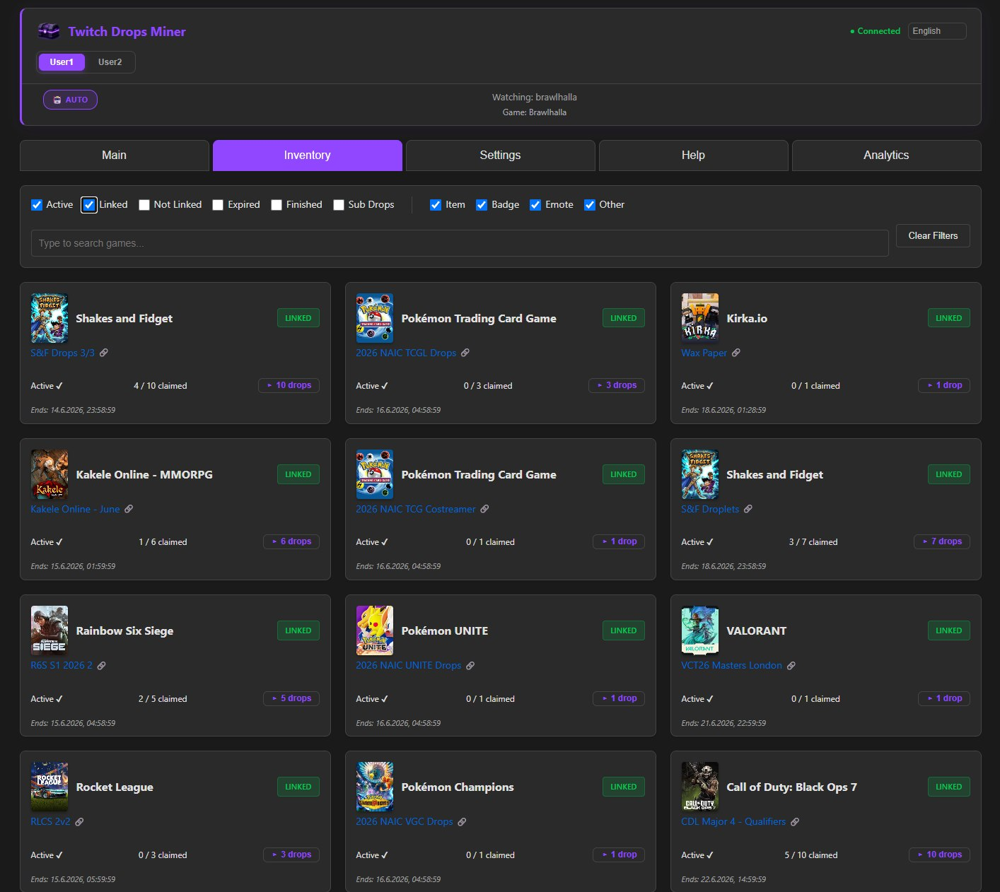
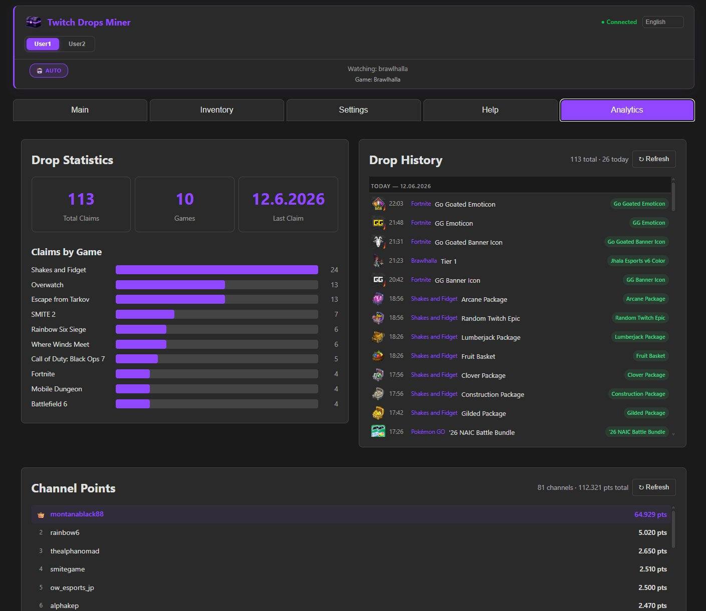
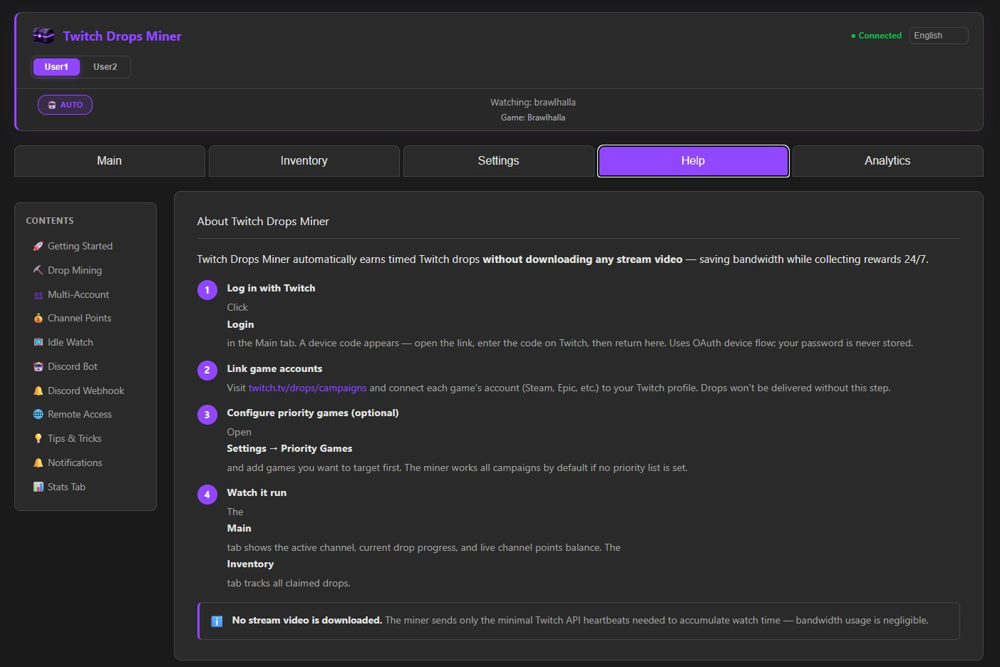

# 🌟 Twitch Drops Miner — SimpliAj Edition

> 🎮 **Automate Twitch Drop Farming — Effortlessly, Headlessly, and Bandwidth-Free**

<p align="center">
  <a href="https://github.com/SimpliAj/twitchdropsminer/stargazers"></a>
  <a href="https://github.com/SimpliAj/twitchdropsminer/releases"></a>
  <a href="https://github.com/SimpliAj/twitchdropsminer/blob/main/LICENSE"></a>
  <a href="https://www.python.org/downloads/"></a>
</p>

This is an **independently developed and maintained** fork originally based on [rangermix/TwitchDropsMiner](https://github.com/rangermix/TwitchDropsMiner).  
It has diverged significantly and is now its own standalone project with active development, independent features, and bug fixes that go well beyond the upstream codebase.

Upstream changes that make sense will continue to be merged when applicable, but this project follows its own roadmap.

---

## 🔀 What's Different From the Original

The following features and fixes have been added on top of the upstream codebase:

### 👥 Multi-Account Support
- Each Twitch account lives in its own isolated `data/accounts/<name>/` directory (cookies, settings, drop history, channel points)
- Switch accounts from the **System tab** in the web UI — no config files needed
- Full CRUD via REST API: `/api/accounts` (list, add, switch, delete)
- Drop history and channel points are saved per-account; switching accounts shows the correct data instantly

### 🔀 Multi-Account Parallel Mode
Run two completely independent miner instances at the same time — two separate processes, two ports, two data directories, one domain.

- Instance 1 runs on port **8080** with data stored in `data/`
- Instance 2 runs on port **8082** with data stored in `data2/`
- Each instance has its own cookies, login session, settings, drop history, and channel points — fully isolated
- Configured via `TDM_PORT` (listening port) and `TDM_DATA_DIR` (data directory) environment variables
- Both ports need to be reachable, or use Nginx to expose only 80/443 and proxy both instances on one domain

**Docker Compose (both instances):**

```yaml
services:
  tdm-account1:
    build: .
    ports:
      - "8080:8080"
    volumes:
      - ./data:/app/data
      - ./logs:/app/logs
    environment:
      - TZ=Europe/Vienna
      - WEB_PASSWORD=yourpassword
      - TDM_PORT=8080
      - TDM_DATA_DIR=data
    restart: unless-stopped

  tdm-account2:
    build: .
    ports:
      - "8082:8082"
    volumes:
      - ./data2:/app/data
      - ./logs2:/app/logs
    environment:
      - TZ=Europe/Vienna
      - WEB_PASSWORD=yourpassword
      - TDM_PORT=8082
      - TDM_DATA_DIR=data
    restart: unless-stopped
```

**From source — PM2 (two named processes):**

```bash
TDM_PORT=8080 TDM_DATA_DIR=data      pm2 start main.py --name twitchdrops  --interpreter python3
TDM_PORT=8082 TDM_DATA_DIR=data2     pm2 start main.py --name twitchdrops2 --interpreter python3
pm2 save
```

**From source — two terminals:**

```bash
# Terminal 1
TDM_PORT=8080 TDM_DATA_DIR=data   python main.py

# Terminal 2
TDM_PORT=8082 TDM_DATA_DIR=data2  python main.py
```

**Nginx reverse proxy (single domain, two accounts):**

```nginx
server {
    listen 443 ssl;
    server_name tdm.example.xyz;

    # Account 1 — root path
    location / {
        proxy_pass         http://127.0.0.1:8080;
        proxy_http_version 1.1;
        proxy_set_header   Upgrade $http_upgrade;
        proxy_set_header   Connection "upgrade";
        proxy_set_header   Host $host;
    }

    # Account 2 — /acc2/ path
    location /acc2/ {
        proxy_pass         http://127.0.0.1:8082/;
        proxy_http_version 1.1;
        proxy_set_header   Upgrade $http_upgrade;
        proxy_set_header   Connection "upgrade";
        proxy_set_header   Host $host;
    }
}
```

**Accessing both dashboards:**
- Account 1: `https://tdm.example.xyz/` (or `http://localhost:8080`)
- Account 2: `https://tdm.example.xyz/acc2/` (or `http://localhost:8082`)
- The web dashboard shows account switcher buttons labeled with each account's Twitch username. Click to jump between dashboards, or append `?acc=2` to the URL to go directly to account 2.

### 💰 Channel Points Auto-Claimer
- Automatically claims bonus channel point chests via both WebSocket (PubSub) and GQL polling (60s fallback)
- Fixes upstream issues where chests were missed due to unreliable PubSub delivery
- Toggle in Settings tab; real-time balance shown in the Main tab
- **Points (Session)** stat tracks total bonus points claimed in the current session

### 💤 Idle Watch
- When no drop campaigns are active, automatically watches configured channels to farm channel points
- **Auto: use followed channels** — fetches all channels you follow on Twitch that are currently live (via Helix API); no manual config needed
- Manual channel list with priority ordering
- **Quick Controls** show a "Start Idle Watch" button when idle channels are available, and a "Switch Channel" button while idle-watching
- The switch endpoint skips offline channels and cycles through the full list

### 📊 Channel Points Tracker
- Live per-channel balance with session history
- Compact "Recent channels" section showing the 3 most recently active channels in the main view
- Full ranked list in the **Channel Points tab**

### 🔔 Discord Webhook Notifications
- Drop claimed → embed with game, drop name, reward, item thumbnail image, and **account name**
- Channel points bonus chest → embed with channel, bonus amount, balance, and **account name**
- Two separate webhook URLs (drops / channel points) configurable in Settings
- Test button included to verify webhooks without waiting for a real event
- Account name in footer makes it easy to distinguish multiple accounts using the same webhook

### 🤖 Discord Bot Integration
A dedicated Discord bot that pairs with your miner instance and sends rich, live-updating notifications — no webhook URLs needed.

**Slash Commands**
| Command | Description |
|---------|-------------|
| `/link <url> <code>` | Pair the bot with your miner dashboard |
| `/unlink` | Remove the pairing |
| `/setchannel drops` | Add a channel for drop notifications (multi-server) |
| `/setchannel points` | Add a channel for channel points notifications (multi-server) |
| `/dashboard` | Post a live-updating embed with control buttons |
| `/devpanel` | *(Dev-restricted)* Global stats + "Post Live Stats" embed |

**Key features:**
- **Multi-server support** — run `/setchannel` in multiple Discord servers; all configured channels receive notifications simultaneously
- **Drop notifications** — one embed per drop, with reward thumbnail image, game, drop name, reward name, and account name in the footer
- **Channel points notifications** — fires on gains ≥ 25 pts, showing channel, amount, balance, and account name
- **Live dashboard embed** — auto-updates every 30s on state change; shows status, watching channel, points balance, and drop count; owner-only control buttons (Pause/Resume, Switch Mode, View Campaigns, Last Drops, Refresh)
- **Live global stats embed** — `/devpanel → Post Live Stats Here` posts a public embed showing total drops, drops today, channel points, and paired accounts; auto-updates every 30 min and survives bot restarts
- **Web UI channel config** — Settings → Discord Bot shows all configured notification channels with name, server, and individual Remove buttons per channel

**Invite the bot:**
[➕ Add TwitchDropsMiner Bot to your server](https://discord.com/oauth2/authorize?client_id=1513555081218359506&permissions=84992&integration_type=0&scope=bot)

**Setup:**
1. Invite the bot to your server using the link above
2. In the web dashboard, go to **Settings → Discord Bot → Generate code**
3. In Discord, run: `/link https://your-server:8081 DROPS-XXXXXXXX`
4. Run `/setchannel drops` and `/setchannel points` in the channels where you want notifications
5. Run `/dashboard` to post a live-updating stats embed with control buttons

### 🖥️ Web UI Improvements
- **State-aware Quick Controls** — equal-size 2×2 grid; buttons highlight based on what the miner is currently doing:
  - 🟢 Green: Drop Mining Active (currently farming drops)
  - 🟡 Yellow: Skip Game (while a drop is active)
  - 🟣 Purple: Start Drop Mining / Switch Channel (while idle-watching)
- **Twitch username** displayed in login form instead of raw user ID
- **Drop Name Blacklist** — comma-separated keywords; drops whose name contains any keyword are skipped
- **Inventory filter fixes** — correct AND/OR logic; both Linked/Not-Linked unchecked shows all campaigns
- **Dark 7-tab layout**: Main, Inventory, Channel Points, History, Settings, System, Help
- **Drop History tab** — grouped by date, compact single-line rows with item thumbnail images
- **Mobile-responsive** — full `@media` breakpoints at 768px and 480px
- No-cache headers for web assets; auto-updating cache hash on deploy

### 🔒 Dashboard Password Protection
- Set `WEB_PASSWORD` to lock the web UI behind a password with 30-day session cookie
- Change or remove the password from the Settings tab at any time

### 🐛 Bug Fixes (also relevant to upstream)
| Fix | Upstream issue |
|-----|---------------|
| Topics overflow crash (`MinerException`) — reserve buffer, catch gracefully | — |
| Sub-drops (0-minute timers) hidden by default | [#37](https://github.com/rangermix/TwitchDropsMiner/issues/37) |
| Not-Linked drops hidden by default | [#51](https://github.com/rangermix/TwitchDropsMiner/issues/51) |
| Spade watch events sent for all channels (not only idle) | — |
| Channel points webhook missing on WebSocket path | — |
| `sendSpadeEvents` crash on `None` response | — |
| `show_sub_drops`, `claim_channel_points`, `idle_channels` not persisted across restarts | — |
| Discord webhooks not populating from saved settings on page load | — |

### 🔄 Deployment
- `update.sh` — one-command update that preserves `data/accounts/` and all customizations
- Docker Compose with `WEB_PASSWORD` env support

---

## ✨ Features

- 🚀 **Streamless Mining** — Earn drops without streaming video by sending Twitch watch events
- 🔍 **Automatic Campaign Discovery** — Detects new drop events automatically
- ⚙️ **Auto Channel Switching** — Always mines the best available stream
- 💾 **Persistent Login** — OAuth login saved via cookies
- 🕹️ **Simple Web UI** — Manage everything from your browser
- 🛡️ **Safe Frontend Rendering** — Dynamic UI content is rendered with DOM APIs to avoid HTML injection
- 🧩 **Docker-Ready** — One command to deploy anywhere
- 💰 **Channel Points Auto-Claimer** — Bonus chests claimed within 60s automatically
- 💤 **Idle Watch** — Earns channel points on favorite channels when no drops are active
- 📊 **Channel Points Tracker** — Live balance display with persistent history
- 🤖 **Discord Bot** — Live dashboard embed + drop/points notifications across multiple Discord servers

---

## 🧰 Quick Start

### 🐳 Build from Source with Docker (Recommended)

```bash
git clone https://github.com/SimpliAj/twitchdropsminer.git
cd twitchdropsminer
docker compose up -d
```

### 📦 Docker Compose with custom options

```yaml
services:
  twitch-drops-miner:
    build: .
    ports:
      - "8080:8080"
    volumes:
      - ./data:/app/data
      - ./logs:/app/logs
    environment:
      - TZ=Europe/Vienna        # Set your timezone
      - WEB_PASSWORD=yourpassword  # Optional: lock the dashboard
    restart: unless-stopped
```

### 🧑‍💻 From Source (without Docker)

```bash
pip install -e .
python main.py
```

Visit 👉 **<http://localhost:8080>**

### 👥 Multi-Account Parallel (Two Instances)

Run both accounts simultaneously with Docker Compose:

```yaml
services:
  tdm-account1:
    build: .
    ports:
      - "8080:8080"
    volumes:
      - ./data:/app/data
      - ./logs:/app/logs
    environment:
      - TZ=Europe/Vienna
      - WEB_PASSWORD=yourpassword
      - TDM_PORT=8080
      - TDM_DATA_DIR=data
    restart: unless-stopped

  tdm-account2:
    build: .
    ports:
      - "8082:8082"
    volumes:
      - ./data2:/app/data
      - ./logs2:/app/logs
    environment:
      - TZ=Europe/Vienna
      - WEB_PASSWORD=yourpassword
      - TDM_PORT=8082
      - TDM_DATA_DIR=data
    restart: unless-stopped
```

Then visit:
- Account 1: **<http://localhost:8080>**
- Account 2: **<http://localhost:8082>**

---

## 🌈 Using the Web App

1. Open `http://localhost:8080`
2. Login with your Twitch account (OAuth device flow)
3. The miner auto-fetches available campaigns
4. Go to **Settings → Games to Watch** and select games:
   - **Select Linked** — auto-selects games where your account is linked
   - **Add Game** — add any custom game by name
   - **Drag to reorder** — top = highest priority
   - **Select All / Deselect All** for quick changes
5. Click **Reload** to apply changes
6. TDM starts mining drops automatically 🎉

**Channel Points (Settings tab):**
- Enable **Auto-claim bonus channel points** to claim chests automatically
- Add channels to **Idle Watch** to earn points when no drops are active
- Balance is shown in the **Main tab** and updates every 5 minutes

📝 **Tip:**  
Make sure your Twitch account is linked to your game accounts →  
👉 [https://www.twitch.tv/drops/campaigns](https://www.twitch.tv/drops/campaigns)

---

## 🔒 Dashboard Password (Remote Access)

To protect the web UI when exposing it publicly (e.g. running on a VPS), set the `WEB_PASSWORD` environment variable:

```bash
# From source
WEB_PASSWORD=yourpassword uv run main.py
```

```yaml
# Docker Compose
environment:
  - WEB_PASSWORD=yourpassword
```

The dashboard will show a password prompt on first visit. Auth is stored as a 30-day session cookie. Change or remove the password from the **Settings** tab in the web UI at any time.

> **No `WEB_PASSWORD` set?** The dashboard is open to anyone who can reach the port — fine for localhost, not for public servers.

---

## ⚠️ Notes & Warnings

> ⚠️ **Avoid Watching on the Same Account**  
> Watching Twitch manually while the miner runs can cause progress desync.  
> Use a different account if you want to watch live streams while mining.

> 💡 **Requirements**  
> Python 3.12+  
> Docker optional but recommended  
> Persistent data stored in `/data`

---

## 🖼️ Screenshots

<details>
<summary>📊 Main Dashboard</summary>


</details>

<details>
<summary>🎒 Inventory</summary>


</details>

<details>
<summary>📈 Analytics</summary>


</details>

<details>
<summary>❓ Help</summary>


</details>


---

## 💬 Contributing

⭐ **Star this repo** if it's useful!  
💬 [Open an issue](../../issues) or [submit a PR](../../pulls) for bugs and improvements.

---

## 🎯 Project Goals

| Goal | Description |
|------|--------------|
| 🎯 **Focus** | Twitch Drops automation |
| 🧩 **Ease of Use** | Simple web UI |
| 🛡️ **Reliability** | Designed for continuous operation |
| ⚙️ **Efficiency** | Minimal API calls, Twitch-friendly |
| 🐳 **Deployment** | Docker-first, headless operation |

---

## 🙏 Acknowledgments

This project builds on the work of:
- [@DevilXD](https://github.com/DevilXD) — original creator of [TwitchDropsMiner](https://github.com/DevilXD/TwitchDropsMiner)
- [@rangermix](https://github.com/rangermix) — upstream fork this project branched from

For translation credits, see the [Original Project Credits](#original-project-credits) section below.

---

## 🧾 Disclaimer

> This project is actively developed. It is stable and runs continuously in production,  
> but use it at your own risk. Always back up your `data/` directory before updating.

---

## 🧑‍💻 Original Project Credits

<!---
Note: The translations credits are sorted alphabetically, based on their English language name.
When adding a new entry, please ensure to insert it in the correct place in the second section.
Non-translations related credits should be added to the first section instead.

Note: When adding a new credits line below, please add two trailing spaces at the end
of the previous line, if they aren't already there. Doing so ensures proper markdown
rendering on Github. In short: Each credits line should end with two trailing spaces,
placed past the period character at the end.

• Last line can have the two trailing spaces omitted.
• Please ensure your editor won't trim the trailing spaces upon saving the file.
• Please ensure to leave a single empty new line at the end of the file.
-->

@guihkx - For the CI script, CI maintenance, and everything related to Linux builds.  
@kWAYTV - For the implementation of the dark mode theme.  

@Bamboozul - For the entirety of the Arabic (العربية) translation.  
@Suz1e - For the entirety of the Chinese (简体中文) translation and revisions.  
@wwj010 - For the Chinese (简体中文) translation corrections and revisions.  
@zhangminghao1989 - For the Chinese (简体中文) translation corrections and revisions.  
@Ricky103403 - For the entirety of the Traditional Chinese (繁體中文) translation.  
@LusTerCsI - For the Traditional Chinese (繁體中文) translation corrections and revisions.  
@nwvh - For the entirety of the Czech (Čeština) translation.  
@Kjerne - For the entirety of the Danish (Dansk) translation.  
@roobini-gamer - For the entirety of the French (Français) translation.  
@Calvineries - For the French (Français) translation revisions.  
@ThisIsCyreX - For the entirety of the German (Deutsch) translation.  
@Eriza-Z - For the entirety of the Indonesian translation.  
@casungo - For the entirety of the Italian (Italiano) translation.  
@ShimadaNanaki - For the entirety of the Japanese (日本語) translation.  
@Patriot99 - For the Polish (Polski) translation and revisions (co-authored with @DevilXD).  
@zarigata - For the entirety of the Portuguese (Português) translation.  
@Sergo1217 - For the entirety of the Russian (Русский) translation.  
@kilroy98 - For the Russian (Русский) translation corrections and revisions.  
@Shofuu - For the entirety of the Spanish (Español) translation and revisions.  
@alikdb - For the entirety of the Turkish (Türkçe) translation.  
@Nollasko - For the entirety of the Ukrainian (Українська) translation and revisions.  
@kilroy98 - For the Ukrainian (Українська) translation corrections and revisions.  
